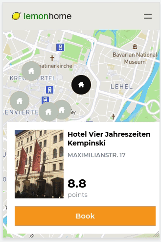
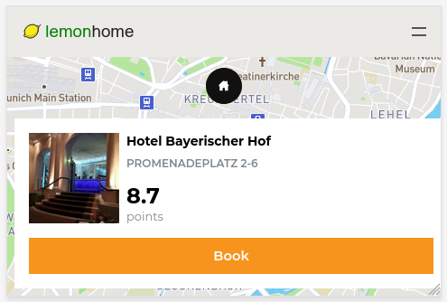

# About

It's an interactive map that shows interesting hotels close to Munich's city center. 

Live demo [here](https://lemon-home-d8c2b.web.app/).

**Note:** The APIs have a daily quota. Be considerate when using the app :snail:.

## Images

**Vertical**

**Horizontal**

## Config

-  Add your [Foursquare](https://developer.foursquare.com/) and [Mapbox](https://account.mapbox.com/) secrets to the config file at `src/app/config`.

## Setup

- Install project dependencies: `yarn install`.
- Run with `yarn start`.
- Navigate to `http://localhost:4200/` in your browser.

